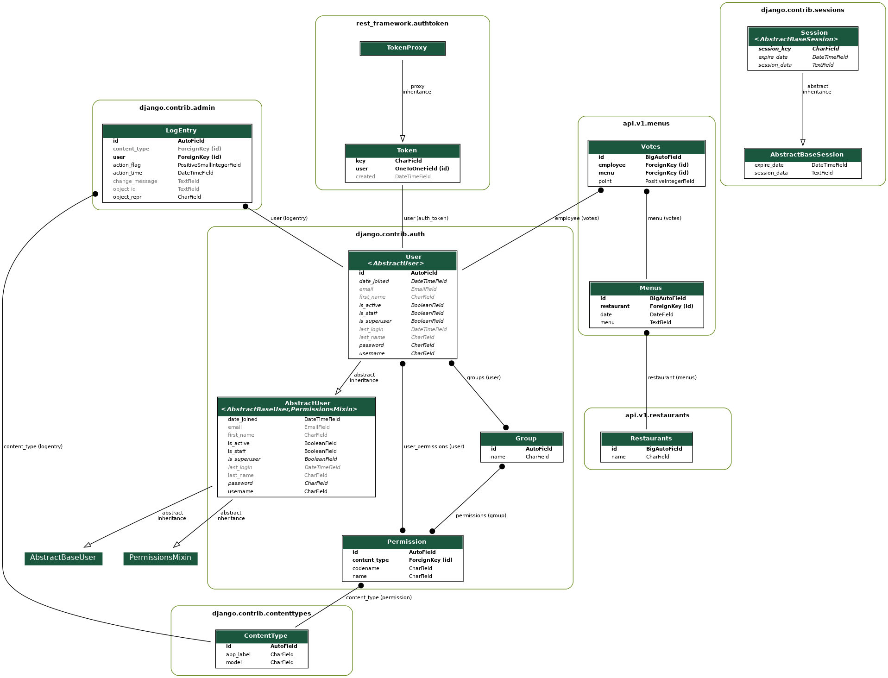

# Lunch Voting Service
An internal service for making decision on which Restaurant to visit for lunch in a company.

## Project Overview

This project is a service for Employees (workers) within an organisation to vote food menus for decision of a place (Restaurant) to go for Lunch.

### Architecture
The schema diagram of the database, generated using **django_extensions** is as shown below:



Once the project is running, the endpoint **/api/[version]/docs/swagger/** to view the API docs and interact with it.

## How it works

Menus to be voted for are Menus uploaded on the particular day of voting, this is achieved by adding *uploaded_date* field to *Menu* so that the implementation can validated if it is eligible for voting or not. The *employee* type user who is allowed to vote only a single *Menu* instance per day for the first version of the API and up to 3 *Menu* instances per day for the second version of the API.

API versioning is *URL* based versioning as can be seen from the *OpenAPI* based docs provided at this endpoint **/api/[version]/docs/swagger/**. For version 1, the API routes traffic to an API view which checks the vote counts that day by the requesting user (employee type). If the count is less than 1 (i.e, 0), then it allows then it implements the vote request for that user. But if the count is greater than 3, it will return a forbidden status code defining that the user is not allowed to vote for more than 1 *Menu* instance.

For the version 2, the restricting number of votes is 3, hence, a user can continue voting for more *Menu* instances upto a count of 3, after which the user will be forbidden to vote again for that day. Points are associated to votes for the version 2. default point for version 1 is 1. But version 2 allows the user right to vote minimum of point of 1 and maximum point of 3 for a particular *Menu* instance.

An endpoint exposes the winning *Menu* based on the summation of the vote count with respect to the points accumulated by each *Menu* per vote.
The *Menu* instance with the highest value of summation{vote.point} wins the selection. Hence for that day, the restaurant that created that *Menu* becomes the winning restaurant for lunch.

## Running the Service

Once the project development environment setup is done and the virtual environment is fully setup and functional, run the following command on the project directory to spin up the server.

```shell
python manage.py runserver
```

### Running tests

To run tests, execute the command on the root directory

```shell
python manage.py test
```

### Running code formatter (black)

**Black** is the code formatter used, to run the code formatter, execute the following command on the root directory.

```shell
black .
```

### Running code linter (flake8)

The code linter used in this project is **flake8**, to run the code linter, execute the command below.

```shell
flake8
```

### Running static type checker (mypy)

The static type checker used in this project is **mypy**, to run the type checker, execute the command below.

```shell
mypy .
```

*Note:* Your changes must pass all these test before you can successfully make a commit.
