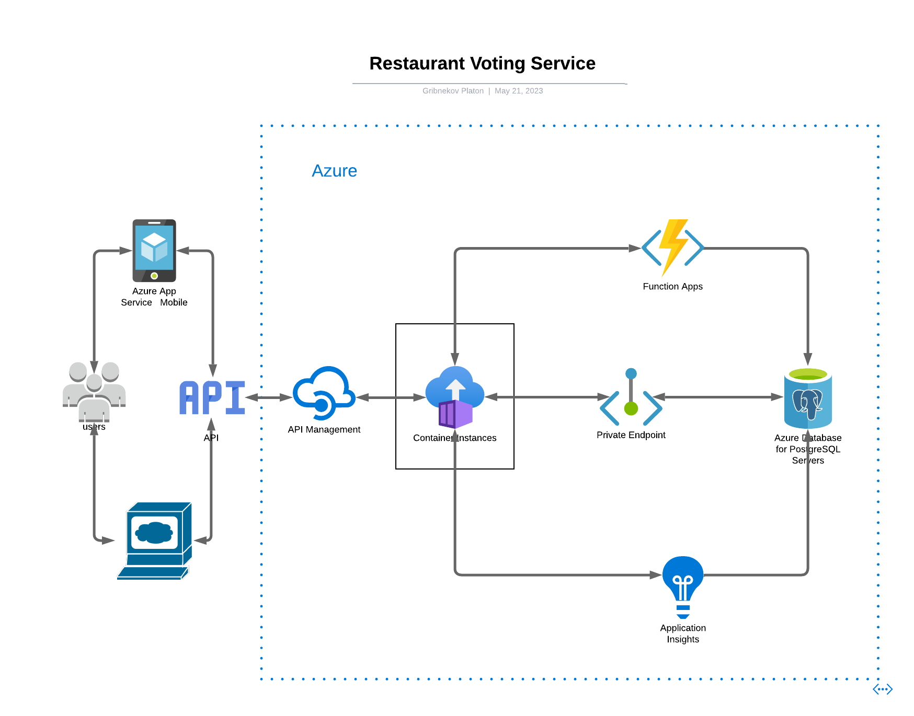

# Restaurant Voting Service
An internal service for making decision on which Restaurant to visit for lunch in a company.

## Project Overview

This project is a service for Employees (workers) within an organisation to vote food menus for decision of a place (Restaurant) to go for Lunch.

### Architecture

The schema diagram of the database, generated using **django_extensions** is as shown below:


### HA Cloud Diagram

This diagram shows the architecture of the High Ability Cloud Architecture.



Here is the architecture diagrapm published.

[HA Cloud Diagram](https://lucid.app/documents/view/61941ca4-afcb-48bf-81cd-73c7318d9d46)

Once the project is running, the endpoint **/api/swagger/** to view the API docs and interact with it.

## How it works

### API Version Control

The provided code represents the URL configuration for an API in a Django project. Here's a breakdown of the code:

Here, we use api version control managed by url. But, you can also choose default url using `/api/def`. In this case, you can notify api version with `X-API-Version`. If you don't notify version, the middleware process the request with latest api version. <b>So, mostly, in mobile app, you may use this api.</b>

In the main `api/urls.py` file in the API directory:

- The /api/v1/ endpoint is mapped to the URLs defined in `api.v1.urls`.
- The /api/v2/ endpoint is mapped to the URLs defined in `api.v2.urls`.

In the `api/v1/urls.py` file:

- The UserAPIView view is mapped to the `/api/v1/employees/` endpoint.
- The AuthAPIView view is mapped to the `/api/v1/auth/` endpoint.
- The RestaurantsViewSetV1 viewset is registered for the `/api/v1/restaurants/` endpoint.
- The MenusViewSetV1 viewset is registered for the `/api/v1/menus/` endpoint.
- The router's URLs are included in the URL patterns using include(`router.urls`).

In the `api/v2/urls.py` file:

- The UserAPIView view is mapped to the `/api/v2/employees/` endpoint.
- The AuthAPIView view is mapped to the `/api/v2/auth/` endpoint.
- The RestaurantsViewSetV1 viewset is registered for the `/api/v2/restaurants/` endpoint.
- The MenusViewSetV2 viewset is registered for the `/api/v2/menus/` endpoint.
- The router's URLs are included in the URL patterns using include(`router.urls`).

The `api/middleware` is a custom middleware that performs version control for API requests:

- It checks if the request path does not start with /api/def.
- If it doesn't, it allows the request to continue to the next middleware or view.
- If it does, it extracts the version from the `X-API-Version` header. If the header is not present, it defaults to version 2.
- It modifies the request's `path_info` to include the version prefix (e.g., `/api/v2`) and removes the `/api/def` prefix from the original path.
- Finally, it returns the modified request to proceed with further processing.
This middleware essentially redirects requests from `/api/def` to the appropriate API version based on the `X-API-Version` header or defaults to version 2.

## Running the Service

### Prepare the enviroment

#### Linux

```shell
python -m venv .venv
source ./.venv/bin/activate
python -m pip install -r requirements.txt
```

#### Windows

```shell
python -m venv .venv
./.venv/Scripts/activate
python -m pip install -r requirements.txt
```

#### Running of the application

Once the project development environment setup is done and the virtual environment is fully setup and functional, run the following command on the project directory to spin up the server.

```shell
python manage.py runserver
```

### Running tests

To run tests, execute the command on the root directory

```shell
python manage.py test
```

### Running code formatter (black)

**Black** is the code formatter used, to run the code formatter, execute the following command on the root directory.

```shell
black .
```

### Running code linter (flake8)

The code linter used in this project is **flake8**, to run the code linter, execute the command below.

```shell
flake8
```

### Running static type checker (mypy)

The static type checker used in this project is **mypy**, to run the type checker, execute the command below.

```shell
mypy .
```

*Note:* Your changes must pass all these test before you can successfully make a commit.

## Running with Docker
First you have to make sure that you have docker installed and running, then run the *build_image.sh* bash script as below:

*Windows*
```shell
scripts\build_image.bat restaurant-vote-service
```

*Linux*
```bash
bash scripts/build_image.sh restaurant-vote-service
```
*restaurant-vote-service* is the *tag* for the image after it's built.
The above command builds the image and run a container from the image, if your desired feature is to run an existing image then, you might want to run the following command instead.

```bash
docker run -p 8000:80 gribp/restaurant-vote-service
```
You may have to do this as a root user for this to work.
